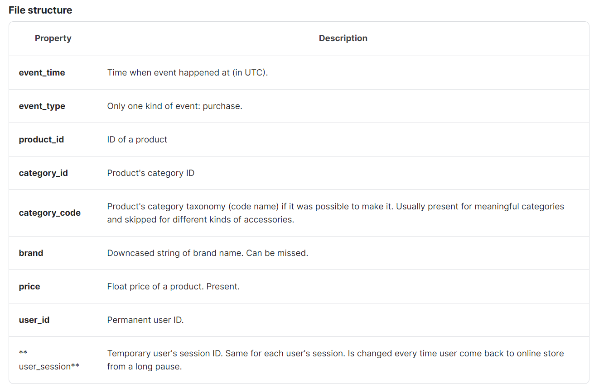
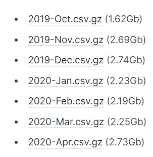
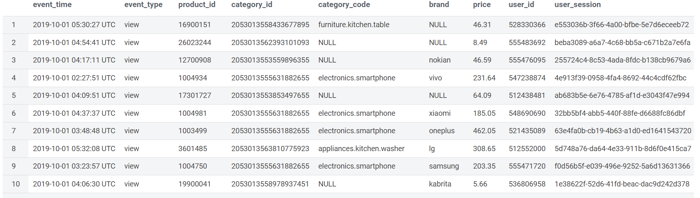

# user-activitiy-log-batch-processor

# 개요

kaggle의 특정 데이터 셋을 이용하여 사용자 activity 로그를 Hive table 로 제공하기 위한 Spark Application 개발

</br>
</br>

# 분석

## 데이터 정의

- category_code, brand 는 null 값 가능



</br>

## 데이터 샘플

```markdown
| event_time              | event_type | product_id | category_id       | category_code               | brand    | price | user_id    | user_session                           |
|-------------------------|------------|------------|-------------------|-----------------------------|----------|-------|------------|----------------------------------------|
| 2019-10-01 00:00:00 UTC | view       | 44600062   | 2103807459595387724 |                             | shiseido | 35.79 | 541312140 | 72d76fde-8bb3-4e00-8c23-a032dfed738c  |
| 2019-10-01 00:00:00 UTC | view       | 3900821    | 2053013552326770905 | appliances.environment.water_heater | aqua     | 33.20 | 554748717 | 9333dfbd-b87a-4708-9857-6336556b0fcc  |
| 2019-10-01 00:00:01 UTC | view       | 17200506   | 2053013559792632471 | furniture.living_room.sofa  |          | 543.10 | 519107250 | 566511c2-e2e3-422b-b695-cf8e6e792ca8  |
| 2019-10-01 00:00:01 UTC | view       | 1307067    | 2053013558920217191 | computers.notebook          | lenovo   | 251.74 | 550050854 | 7c90fc70-0e80-4590-96f3-13c02c18c713  |
| 2019-10-01 00:00:04 UTC | view       | 1004237    | 2053013555631882655 |                             |          | 1081.98 | 535871217 | c6bd7419-2748-4c56-95b4-8cec9ff8b80d  |
```
</br>

## 데이터 셋

- 제공되는 데이터셋이 월 단위 파일이므로 수집 및 배치 주기를 월 단위로 가정



</br>
</br>

# 설계

## 요구 조건 대응

- KST 기준 daily partition 처리
    - event_time이 UTC 기준으로 제공되기 때문에 KST 변환 작업 필요
    - 파티션은 일별 구성하므로 yyyymmdd 로 정의
    - KST 시간을 알아볼 수 있도록 event_time_kst 컬럼 추가
    - KST 시간대로 변경하여 적재 시 수집과 적재의 기준 시간 차이로 인해 매월 첫째날, 마지막날 데이터에서 날짜에 대한 중복 발생 가능
        - 데이터 처리시 overwrite 방식 사용 불가
        - 재처리시 중복 데이터 발생 가능성 있음
        - 에러 발생시 디버깅 및 재처리를 위한 로그 파일 작성
            - 에러 발생 시점에 처리중이던 데이터는 제거 후, 해당 파일을 처음부터 다시 재처리 진행하는 방식 적용
        - 에러가 발생 시점의 처리한 파일의 데이터 제거 후 재처리 진행하는 방식 적용
- 재처리 후 parquet, snappy 처리
    - spark job 에서 정의
- External Table 방식으로 설계
    - hive table 생성 시 External Table 로 생성
    - 데이터 적재 시 파티션 생성 로직 필요
- 추가 기간 처리에 대응가능하도록 구현
    - spark application 수행 시 파라미터를 받아 처리할 수 있도록 구성
- 배치 장애시 복구를 위한 장치 구현

</br>

## 환경 정보

java : 1.8.0

spark : 3.4.3

hive : 3.1.2

hadoop : 3.3.1

</br>

## 기타


원천 데이터 파일의 사이즈가 크기 때문에, 데이터셋을 그대로 사용시 애플리케이션 실행 과정에서 소요되는 리소스가 많을 것으로 예상되어 샘플 데이터 생성 후 개발 및 테스트 진행

[처리 방법]

- 2019-Oct.csv : 날짜 별 100 건씩 추출
    - 헤더 포함 총 3101 건
    - 기본 배치 테스트 용
- 2019-Nov.csv : 앞뒤 1000 라인씩 추출
    - 헤더 포함 총 2000 건
    - 중복 날짜 처리 테스트용

</br>

## 결과

